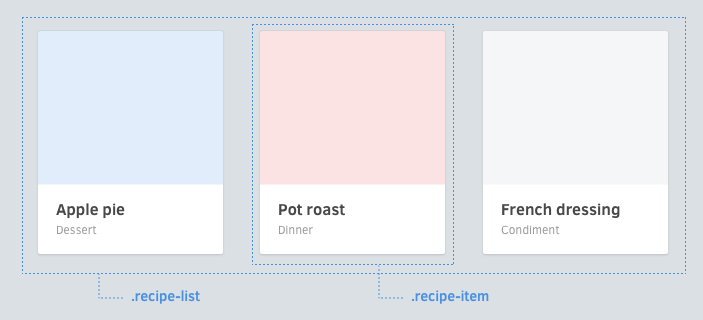

# 頁面佈局(Layouts)



## Avoid positioning properties 要避開座標屬性
Components should be made in a way that they're reusable in different contexts. Avoid putting these properties in components:<br>
建立出來的元件必須是可以在不同地方重複使用的，因此我們要避免使用到以下的屬性。

  * Positioning (`position`, `top`, `left`, `right`, `bottom`)
  * 座標相關 (`position`, `top`, `left`, `right`, `bottom`)
  * Floats (`float`, `clear`)
  * 浮動相關 (`float`, `clear`)
  * Margins (`margin`)
  * 邊距相關 (`margin`)
  * Dimensions (`width`, `height`)
  * 尺寸相關 (`width`, `height`)

## Fixed dimensions 固定尺寸

Exception to these would be elements that have fixed width/heights, such as avatars and logos.
當然有些例外的情況是需要固定的長寬，像是 替身(avatar) 或是標誌(logo)。

## Define positioning in parents 在父節點定義位置

If you need to define these, try to define them in whatever context they will be in. In this example below, notice that the widths and floats are applied on the *list* component, not the component itself. <br>
如果你需要定義上述的屬性，試著定義他們在任何區塊都是一樣的。例如下面的範例，要注意到寬度及浮動的屬性是設定在 *list* 元件，而不是元件本身。

  ```css
  .article-list {
    & {
      @include clearfix;
    }

    > .article-card {
      width: 33.3%;
      float: left;
    }
  }

  .article-card {
    & { /* ... */ }
    > .image { /* ... */ }
    > .title { /* ... */ }
    > .category { /* ... */ }
  }
  ```

How do you apply margins outside a layout? Try it with Helpers.
如何在頁面佈局外使用邊距，試試 Helpers 吧。
[Continue 繼續 →](helpers.md)
<!-- {p:.pull-box} -->
